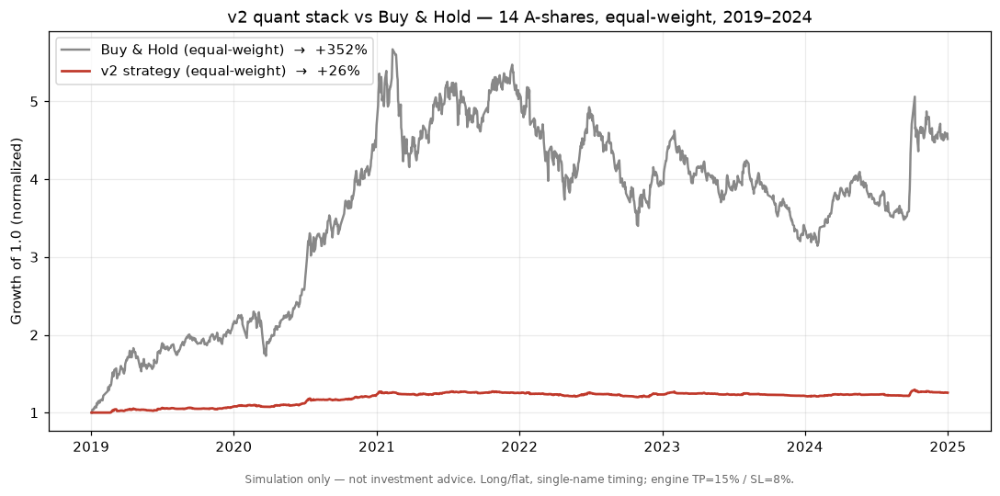

# v2 Stack — Out-of-Sample Backtest Results

> ⚠️ **Simulation/research only — not investment advice.** Long/flat, single-name
> timing on historical data. No live fills, no slippage model beyond commission +
> stamp tax. See the disclaimer in [`README.md`](../README.md).

This is the first honest, out-of-sample evaluation of the **v2 signal/sizing stack**
(`SignalLibrary` + `RegimeDetector`, fused by
[`QuantSignalV2Strategy`](../src/strategy/quant_v2.py)) run through the A-share backtest
engine. It answers the question the project had never actually tested: *does the v2
stack predict anything?* (Roadmap item **P2.1** / issue #53.)

## TL;DR — the honest verdict

**No demonstrated alpha.** Over a full 6-year cycle the strategy captured roughly **7%**
of what simply buying and holding would have returned, and it **beat buy-and-hold on 0 of
14** names. What the v2 stack actually is, in its current configuration, is a
**drawdown-limiter that caps trend upside** — it sits in cash most of the time and exits
winners early, so it barely participates in the market.



The red line (the strategy) is nearly flat at +26% while the grey line (buy-and-hold) rides
the 2020–21 bull to ~5× and ends **+352%**. That gap *is* the result.

## Results by market regime

Equal-weight, 14 sector-diverse A-shares. The regime split is what makes the picture honest
— a long/flat timing strategy looks good in a downturn (it's in cash) and bad in a bull (it
misses the trend):

| Window | Strategy (mean) | Buy & Hold (mean) | Excess | Sharpe | Max DD | Beat B&H |
|---|---|---|---|---|---|---|
| **Full cycle** 2019–2024 | **+25.5%** | **+351.7%** | **−326.2%** | 0.14 | −16.0% | **0 / 14** |
| Bull 2019–2021 | +25.2% | +410.3% | −385.1% | 0.41 | −11.2% | 0 / 14 |
| Bear 2022–2024 | +4.7% | +1.1% | +3.6% | −0.19 | −10.8% | 8 / 14 |

- **Bull market:** the strategy returns +25% while buy-and-hold returns +410% — it forfeits
  ~94% of the upside. This is the dominant story and it is structural (see below).
- **Bear market:** the strategy roughly breaks even (+4.7%) versus a flat market (+1.1%) and
  "wins" 8/14 — but its **mean Sharpe is negative (−0.19)**, so even where it beats the
  index it is not earning that return efficiently. The edge is *avoided losses*, not skill.

## Full-cycle detail (2019–2024, per name)

| Symbol | Sector | Strategy | Buy & Hold | Excess | Sharpe | Max DD | Win rate |
|---|---|---|---|---|---|---|---|
| 600519 | 白酒/consumer | +14.0% | +316.9% | −302.9% | −0.01 | −8.8% | 37% |
| 000858 | 白酒/consumer | +34.4% | +456.7% | −422.3% | 0.34 | −12.0% | 34% |
| 600036 | 银行/bank | +32.3% | +180.7% | −148.3% | 0.36 | −10.3% | 45% |
| 601318 | 保险/insurance | +13.0% | +29.0% | −16.0% | −0.02 | −15.8% | 39% |
| 000333 | 家电/appliance | −0.4% | +240.7% | −241.1% | −0.30 | −26.7% | 30% |
| 600276 | 医药/pharma | +0.8% | +55.4% | −54.6% | −0.36 | −15.3% | 38% |
| 002594 | 汽车/auto | +51.1% | +589.2% | −538.1% | 0.50 | −20.0% | 38% |
| 300750 | 电池/battery | +58.2% | +1152.9% | −1094.7% | 0.53 | −24.4% | 44% |
| 600030 | 券商/broker | +28.6% | +122.3% | −93.7% | 0.30 | −10.4% | 47% |
| 601899 | 有色/materials | +56.5% | +915.3% | −858.8% | 0.55 | −11.4% | 38% |
| 600887 | 乳业/consumer | +6.3% | +92.2% | −85.9% | −0.17 | −10.5% | 38% |
| 601012 | 光伏/solar | +32.4% | +151.8% | −119.4% | 0.32 | −17.9% | 48% |
| 300059 | 金融IT/fintech | +34.9% | +484.5% | −449.6% | 0.33 | −14.2% | 40% |
| 000651 | 家电/appliance | −4.7% | +136.8% | −141.5% | −0.40 | −25.5% | 39% |
| **Mean** | | **+25.5%** | **+351.7%** | **−326.2%** | **0.14** | **−16.0%** | **40%** |

## Why it underperforms

1. **The take-profit rule dominates.** The backtest engine exits every position at
   **+15%** (`config/strategy.yaml → common.take_profit`). On a name that runs +1153%
   (300750/CATL), capturing +15% and re-entering forfeits essentially the entire trend. This
   single rule, not signal quality, drives most of the gap. The v2 *signals* are only ever
   tested as entries on top of a hard profit cap.
2. **Per-trade win rate is low (30–48%).** Even setting the TP aside, the entry signals are
   not separating winners from losers — a ~40% hit rate with the engine's symmetric-ish
   exits is consistent with *no edge*.
3. **Likelihood tables / thresholds are unvalidated priors.** As the audit noted, the
   regime priors, signal weights, and gate thresholds are expert-assigned constants. This
   backtest is the first evidence about them, and the evidence is: they do not predict
   forward returns in this universe/window.

This is consistent with the project's own honest self-assessment: the *machinery* is real
(sequential-Bayesian belief, Kelly, VaR), but the *inputs* were unproven. Now they have been
tested, and in this configuration they do not produce alpha.

## What this changes (next steps)

This result reframes the open roadmap items with evidence behind them:

- **Exit rules first.** Re-run with the take-profit removed/raised and a trailing stop, to
  separate "the signals are bad" from "the 15% TP is bad". (New investigation — highest
  signal/noise.)
- **#54 — fix the Bayesian likelihood derivation.** The calibration loop feeds a mislabeled
  likelihood; correcting it is a prerequisite for the signals to mean anything.
- **#56 — validate the LLM-debate dependency.** The deterministic stack tested here excludes
  the LLM debate that gates live buys; its contribution is still unmeasured.
- **Broaden the test.** 14 large-caps is a small, survivorship-tilted sample. A larger
  universe and a walk-forward split would harden any future claim.

Publishing a negative result is the point: it converts "asserted" into "measured" and gives
the next change a baseline to beat.

## Methodology

- **Universe:** 14 liquid, sector-diverse A-shares (12 main board, 2 ChiNext).
- **Window:** 2019-01-01 → 2024-12-31 (~1,456 trading days), spanning the 2020–21 bull and
  the 2022–24 bear. Sub-periods sliced from the same series.
- **Data:** daily OHLCV via the project's multi-source fetcher (EastMoney → Tencent → adata
  fallback). Forward-adjusted close.
- **Strategy:** `QuantSignalV2Strategy(use_regime=True)` — the v2 `SignalLibrary` consensus
  fused with an HMM/vol regime gate, evaluated on an **expanding window per bar (no
  look-ahead** — enforced by `tests/unit/test_quant_v2_strategy.py`).
- **Engine:** `BacktestEngine` with A-share rules (T+1, board price limits, 100-share lots,
  sell-side stamp tax). Config: capital ¥1,000,000 · commission 0.03% (min ¥5) · stamp tax
  0.1% · stop-loss 8% · take-profit 15% · position size 30%.
- **Baseline:** equal-weight buy-and-hold of the same names over the same window.
- **Sharpe:** annualized, 2.5% risk-free, 252 trading days.

### Reproduce

```bash
python -m scripts.backtest_v2_universe \
    --start 20190101 --end 20241231 \
    --chart docs/assets/backtest-v2-equity.png
# single name:
python -m scripts.backtest_v2 --symbol 300750 --start 20190101 --end 20241231
```

(Network needed on first run to fetch history; pass `--cache-dir <dir>` to cache CSVs for
offline re-runs.)

## Limitations

Single-name **long/flat** timing — no portfolio construction, position netting, shorting, or
cross-sectional ranking. Costs model commission + stamp tax only (no market-impact/slippage).
Large-cap, survivorship-tilted universe. Results are dominated by the engine's fixed exit
rules as much as by the signals. **Simulation only — not investment advice.**
